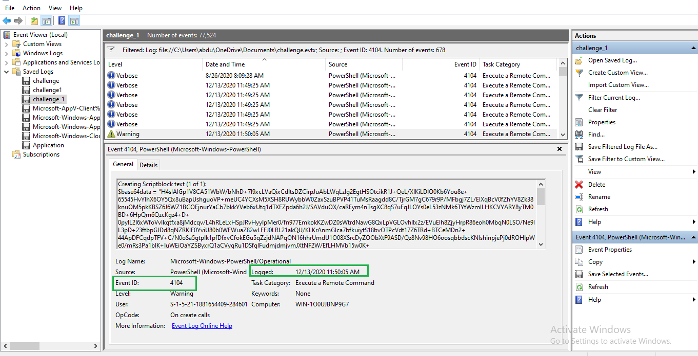
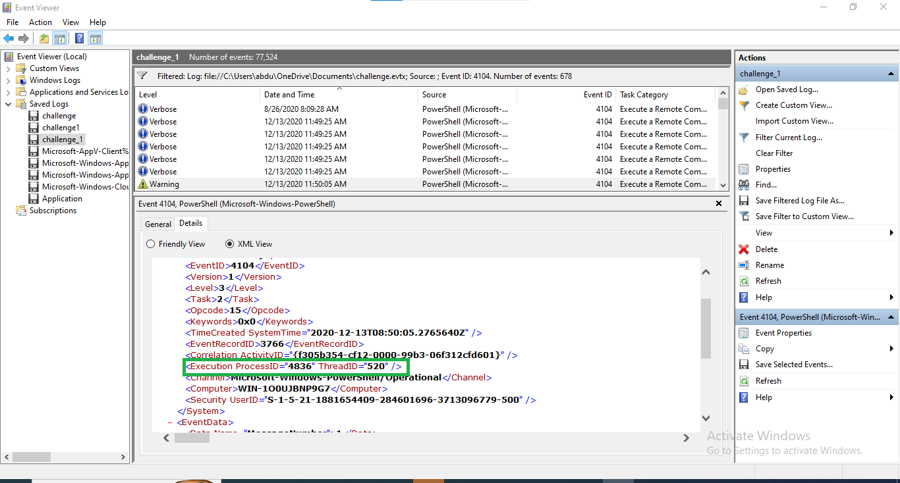

# 🛡️ CTF Challenge 4: Windows Event Log Forensics

Location: Weekend_home_Tasks/Challenge4  
Target File: challenge.evtx  
System Investigated: Windows 10 (PC01.example.corp / MSEDGEWIN10)

---

##  Key Concepts & Definitions

Before the investigation, it is important to understand the "Language of Logs":

* Windows Event Logs (.evtx): These are the "black boxes" of a Windows system. Every time a user logs in, a file is deleted, or a script runs, Windows records it here. They are essential for reconstructing an attacker's timeline.
* Emotet: A notorious "Banking Trojan" that evolved into a primary distributor for other malware (like Ransomware). It is famous for using highly obfuscated PowerShell scripts and Base64 encoding to bypass antivirus.
* Event ID vs. Record ID: * Event ID: The *type* of action (e.g., ID 4104 always means a PowerShell script ran).
    * Record ID: The *serial number* of that specific log entry (e.g., the 27,736th thing that happened on the PC).
* Ctrl + F (The Find Tool): In Event Viewer, this allows you to search for specific strings like "base64" or "net1.exe". *Pro-tip: Always click the first log in the list before searching so it searches from top to bottom.*

---

## 🛠️ Toolset Summary

| Tool | Primary Use Case | How I used it |
| :--- | :--- | :--- |
| Event Viewer | Standard Windows log reader | Used to filter by Event IDs (400, 4104, 104). |
| XML View | Deep dive into log metadata | Used to find hidden details like ProcessID and EventRecordID. |
| Filter Current Log | Narrowing down 77,000+ events | Isolated specific malicious activity out of thousands of normal logs. |
| Base64 Decoder | Reversing script obfuscation | Decoded the Emotet payload to see the actual attacker commands. |

---

## 🕵️ Investigation Steps

### 1️⃣ Detecting PowerShell Downgrade
I started by looking for signs of an attacker trying to bypass modern security by forcing an older version of PowerShell.
* Filter: Event ID 400
* Discovery: Found a session starting with HostVersion 2.0.
* Timestamp: 12/18/2020 6:50:33 PM

### 2️⃣ Anti-Forensics: Log Clearing
Attackers often "wipe the floor" after a crime. I searched for the specific event that records when logs are deleted.
* Filter: Event ID 104
* Evidence: The log was cleared. The Event Record ID was 27736.
* Machine Name: PC01.example.corp

### 3️⃣ Malware Analysis (Emotet Payload)
The most critical part of the investigation was finding the encoded malware script.
* Filter: Event ID 4104 (Script Block Logging).
* Discovery: Found a "Warning" log containing a massive $base64data string.
* Process ID: 4836
* Timestamp: 12/13/2020 11:50:05 AM

### 4️⃣ Insider Threat (Privilege Enumeration)
Confirmed suspicions about an intern (IEUser) checking for administrative access.
* Filter: Event ID 4799.
* Command: The intern used net1.exe to enumerate the Administrators group.

---

## 📷 Investigation Screenshots

### 🔹 Step 1: PowerShell Downgrade Found (ID 400)

### 🔹 Step 2: Log Clear Record ID (XML View)

### 🔹 Step 3: Emotet Encoded Payload & Attack Date

### 🔹 Step 4: Intern Group Enumeration

---

## 🏆 Captured Forensic Flags

* Downgrade Event ID: 400
* Log Clear Record ID: 27736
* Emotet Process ID: 4836
* Suspicious User: IEUser
* Target Group: Administrators

---
*Created by Abdu as part of the Cybersecurity Class Weekend Tasks - 2026*
